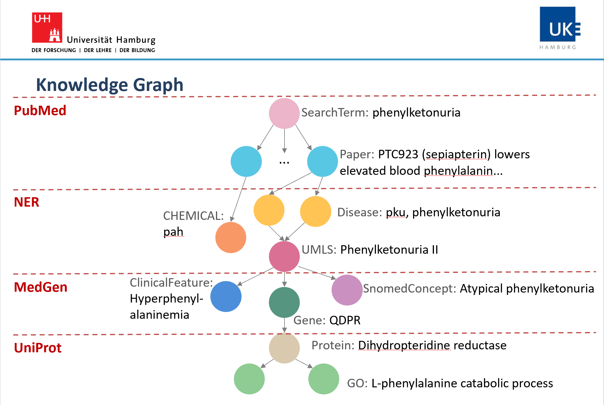
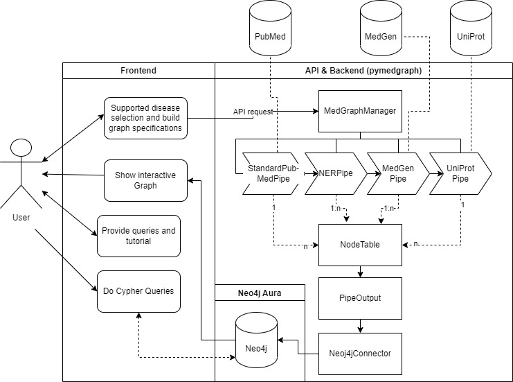

# Biomedical Knowledgegraph
This repository builds the backend of our Master Project (Web Interfaces for NLP) at the University Hamburg in
cooperation with the Universitätsklinikum Hamburg-Eppendorf. Aim of the backend is to build a biomedical knowledge graph based on the
frontend request and upload nodes and relations to a neo4j graph database instance. Start of each build is the Pubmed request
for n articles for the given search term (disease). The abstracts are then processed by our Named Entity Recognition pipeline and based on those results we fetch more data from
the MedGen and UniProt databases. Below you can see the Knowledge Graph structure. You can find below more information
about our developed `pymedgraph` python package as well as the architecture of our backend.



# pymedgraph
The `pymedgraph` python package can be used to create a knowledge graph on a neo4j instance based on a single 
search term (disease). Therefor, the package uses different pipelines which fetch data from well known biomedical databases 
and extract useful information displayed in the graph. 
The following sections give an overview of how to install the package, the package structure as well as the
API documentation and usage guide.
1. Installation
2. Structure
3. API
4. Usage

## 1. install
*** IMPORTANT *** 
In order to use the Neo4jConnector you have to enter the necessary neo4j credentials + url into the `pymedgraph/localconfig.json`
*** END ***
Create a new Environment with <b>Python 3.7</b>, which is required for the scispacy model.
Then clone the repository. 
Activate your python 3.7 environment and change your directory to the package folder
````shell
cd /your/path/to/medknowledgegraph
````
Install requirements
````shell
pip install -r requirements.txt
````
Install the medknowledgegraph package
````shell
pip install -e .
````

Install scispacy model `en_ner_bc5cdr_md` and umls linker.
https://github.com/allenai/scispacy
````shell
pip install https://s3-us-west-2.amazonaws.com/ai2-s2-scispacy/releases/v0.5.0/en_ner_bc5cdr_md-0.5.0.tar.gz
````

Run test suite (with activated venv & installed pytest)
````shell
pytest /your/path/medknowledgegraph/tests/unittests
````

Use following command to solve possible confilct issues with spacy (or install spaCy v3.2):
````
pip install -U spacy
````


### run api
Activate your python 3.7 environment and change your directory to the package folder
````shell
cd /your/path/to/medknowledgegraph
````
Start local app
````shell
python app.py
````
### run notebook on docker
In case you want to run the `pymedgraph` on docker and want play around with jupyter notebooks.
Make sure you have docker installed!
move to package dir
````shell
cd /your/path/to/medknowledgegraph
````
build docker image
````shell
docker build --tag python-med .
````
build container
```shell
docker run -it -p 8888:8888 python-med:latest
```
run notebook within container cli
````shell
jupyter notebook --ip 0.0.0.0 --no-browser --allow-root
````
copy output link from container cli output into browser.
links looks similar to http://127.0.0.1:8888/?token=0e9dff5b82c10cf569fb6a33195e04c61923dabbf6234c14

## 2. `pymedgraph` structure
The package architecture is displayed in the figure below and the package structure is

- pymedgrapg.manager: manages pipelines and request
- pymedgraph.input:
  - get data
- pymedgraph.dataextraction:
  - model and methods to get NER from abstracts
- pymedgraph.graph:
  - build graph relations

The flask api `app.py` receives the request and checks for the authentication token and starts then the data processing by running the
`pymedgraph.manager.MedGraphManager.construct_med_graph()` method of the previously initiated manager object (Note that the Manager and with that all pipelines are 
initiated at the start of the flask app, because of the extremely time-consuming load of the scispacy model and UMLS knowledge base).
The request specifications are passed to the method, which will be parsed and checked by the manager. According to the request specifications the manager runs 
the matching pipelines as you can see in the figure below. To ensure a successful neo4j upload each pipeline returns 
a `pymedgraph.dataextraction.basepipe.PipeOutput` object containing one or more `pymedgraph.dataextraction.basepipe.NodeTable`.
The `NodeTable` does not only store the data to be uploaded but also vital meta data information about the relations to 
the predecessor source node. The `PipeOutpu`s are then passed in the `app.py` to the `pymedgrapg.Neo4jConnector` which manages the data upload.


## 3. API
The api documentation can be found under /pymedgraph/swagger/swagger3_template.yaml and can be passed to the swagger
editor. The api offers three different routes, which have a more detailed description in the documentation.
1. /buildGraph : used by the frontend to build a Knowledge Graph
2. /searchTerms : used by the frontend to get all existing search term nodes of the neo4j graph database
3. /intersection : can be used for graph analysis and returns node intersections on passed graph level for search terms

## 4. usage of main classes
### Manager
````python
from pymedgraph.manager import MedGraphManager
manager = MedGraphManager(config_path='/path/to/localconfig.json', logger=None)
req_specs = {
  "disease": "diabetes",
  "n_articles": 50,
  "delete_graph": False,
  "pipelines": {
    "pubmed": {"run": True},
    "ner": {"run": True, "entityLinks": True},
    "medGen": {"run": True,"Snomed": False, "clinicalFeatures": False},
    "uniProt": {"run": True}}
}
# build graph tables
disease, outputs, delete_graph = manager.construct_med_graph(req_specs)
````
### Neo4jConnector
Here is a simple example of how to use the Neo4jConnector.
```python
from pymedgraph.graph.neo4jconnector import Neo4jConnector
outputs = [] # output of pipelines
# init
neo4j = Neo4jConnector("neo4j-URL", "user_name", "password")
# pass pipe output node tables from manager and upload
neo4j.build_biomed_graph("diabetes", outputs, delete_graph=True)
# you can use the connector to make custom queries, too
custom_query = 'MATCH (g:Gene) RETURN g'
result = neo4j.query(custom_query, None)
```
